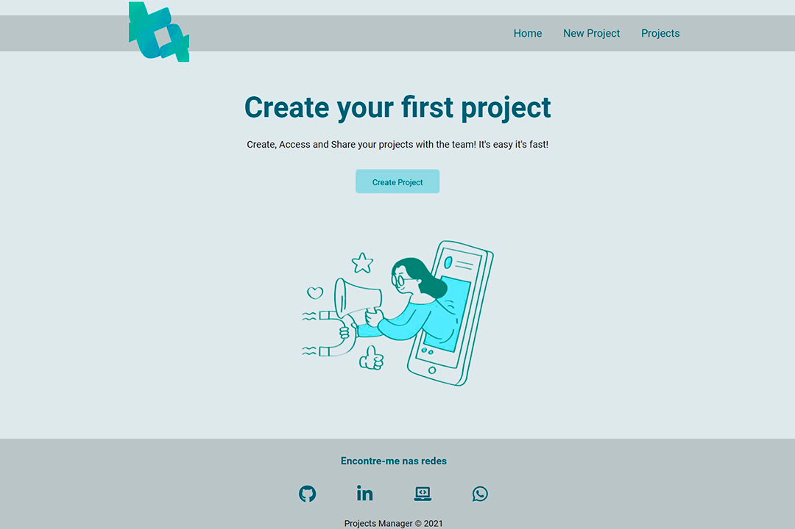

# Projects Manager

 
  
  

 

### This is a plataform web that created for put my knowloedge to the test.
  
Guided by Teacher Matheus Battisti.

Basically the platform runs in a ReactJs environment with a Json Server on the frontend.
The project is still under construction because I've been switching from css module to styled-components.

## Checking the project

After downloading the project and installing the package's dependencies, just run the command yarn start in a terminal and yarn backend in another terminal to upload the Json Server.

## What's missing from the project

  * Finish switching from css module to styled-components
  * Finish editing each route project
  * Finish deleting each route project
  * Make the project responsive

## Next Steps
So that this application reaches a more professional level:

  * MongoDB Database.
  * Update application to TypeScript. (backend)

## Contribution

I will be very grateful if I receive feedback or anything I can add to the project.
